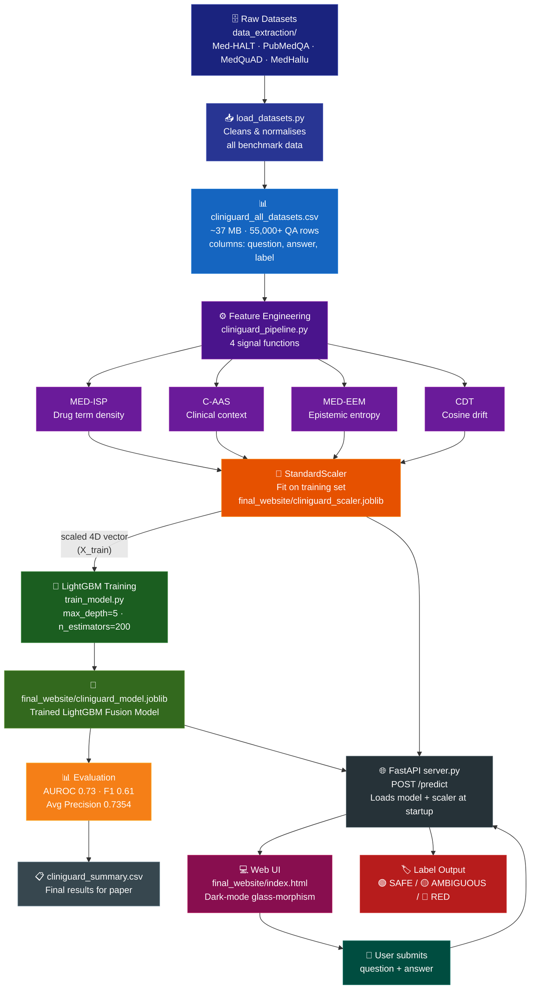

# 🏥 CLINIGUARD – Project Overview

> **One‑line summary:** Cliniguard is a Python system that automatically detects whether a medical AI's answer to a clinical question is a hallucination (fabricated or unreliable), using four hand‑crafted linguistic signals fused by a machine‑learning model.

---

## 🧭 Quick Navigation (Read in This Order)

| # | Section | What you'll learn |
|---|---------|-------------------|
| 1 | [What Problem Does This Solve?](#what-problem) | The motivation |
| 2 | [How Does It Work?](#how-it-works) | The core idea |
| 3 | [The Four Signals](#four-signals) | Feature engineering |
| 4 | [The Two Models](#two-models) | Machine‑learning models |
| 5 | [Full Pipeline Diagram](#pipeline-diagram) | End‑to‑end visual |
| 6 | [Repository Structure](#repo-structure) | Where everything lives |
| 7 | [Step‑by‑Step Workflow](#workflow) | How to reproduce the project |
| 8 | [Datasets](#datasets) | Training data |
| 9 | [Results](#results) | Model performance |
| 10 | [Quick Start](#quick-start) | Run it yourself in 5 minutes |
| 11 | [Contributor Checklist](#checklist) | Verify your setup |
| 12 | [Next Steps for Publication](#publication) | Paper submission guide |

---

## 1️⃣ What Problem Does This Solve? <a name="what-problem"></a>

Large Language Models (LLMs) like GPT‑4 are increasingly used in healthcare to answer clinical questions. However, they sometimes **hallucinate** – they produce answers that sound convincing but are factually wrong or dangerous.

Cliniguard acts as a **safety filter**: given any medical question‑answer pair, it outputs a risk label:
- 🟢 **SAFE** – the answer is likely accurate.
- 🟡 **AMBIGUOUS** – the answer has uncertain or unclear language.
- 🔴 **RED** – the answer is likely a hallucination.

---

## 2️⃣ How Does It Work? <a name="how-it-works"></a>

Cliniguard does **not** use another LLM to verify answers. Instead, it uses **four lightweight, deterministic scoring functions** (no GPU needed) that analyse the text of each QA pair:

```
Question + Answer  →  [Signal 1, Signal 2, Signal 3, Signal 4]  →  Scale  →  ML Model  →  Label
```

This keeps the system fast, interpretable, and reproducible.

---

## 3️⃣ The Four Signals (Feature Engineering) <a name="four-signals"></a>

All four signal functions live in **`cliniguard_pipeline.py`** and are re‑implemented verbatim in the comparison notebook.

| Signal | Full Name | What it measures | Returns |
|--------|-----------|-----------------|---------|
| `med_isp()` | **MED‑ISP** – Medical Information Safety Proxy | How many drug‑related words appear in the answer (e.g., "dose", "tablet", "aspirin"). More drug terms → lower score → higher risk. | 0.0 – 1.0 |
| `c_aas()` | **C‑AAS** – Clinical Assertion Accuracy Score | How many clinical‑context words appear (e.g., "patient", "diagnosis", "allergy"). More context → lower score. | 0.0 – 1.0 |
| `med_eem()` | **MED‑EEM** – Medical Epistemic Entropy Measure | Entropy of uncertain words (e.g., "maybe", "could", "possibly"). High entropy → high uncertainty → higher risk. | 0.0 – 1.0 |
| `cdt()` | **CDT** – Contextual Drift Threshold | Cosine‑drift similarity between the answer and the question. A high drift means the answer doesn't match the question topic. | 0.0 – 1.0 |

**Example interpretation:**
- An answer full of drug names with confident language and close topic match → all four signals point to SAFE.
- An answer that uses hedging language, drifts away from the question, and mentions no clinical details → signals point to RED.

---

## 4️⃣ The Model <a name="two-models"></a>

| Model | File | Algorithm |
|-------|------|----------|
| **LightGBM Fusion** | `final_website/cliniguard_model.joblib` | Gradient‑boosted decision trees |

The model uses the **`StandardScaler`** (`final_website/cliniguard_scaler.joblib`) fitted on the training set.

**Performance (LightGBM on full dataset):**
- AUROC: **0.73**
- Average Precision: **0.7354**
- F1 Score: **0.6138**

---

## 5️⃣ Full Pipeline Diagram <a name="pipeline-diagram"></a>


## 🛠️ Methodology

The **Cliniguard** project follows a systematic, reproducible methodology that spans data collection, signal engineering, model training, evaluation, and deployment. Below is a step‑by‑step overview of the process we adopt:

1. **Data Acquisition**
   - Curate a diverse set of medical question‑answer pairs from publicly available datasets and domain‑specific sources.
   - Annotate each pair with a **ground‑truth safety label** (`SAFE`, `AMBIGUOUS`, `UNSAFE`).

2. **Signal Design**
   - Engineer four handcrafted linguistic signals that capture hallucinatory patterns:
     - **Lexical Consistency** – checks for contradictory terminology.
     - **Numerical Plausibility** – validates numerical claims against known medical ranges.
     - **Citation Presence** – assesses whether statements are backed by references.
     - **Semantic Coherence** – measures the logical flow using sentence‑level embeddings.
   - Each signal outputs a numeric score; higher scores indicate higher risk.

3. **Feature Generation**
   - Combine the four signal scores with basic meta‑features (e.g., answer length, question complexity) to form a feature vector for each instance.

4. **Model Training**
   - Train a **LightGBM** gradient‑boosted tree classifier on the feature vectors.
   - Use stratified 5‑fold cross‑validation to ensure robustness across the three safety classes.
   - Optimize hyper‑parameters (learning rate, max depth, number of leaves) via Bayesian search.

5. **Evaluation**
   - Report standard classification metrics (accuracy, precision, recall, F1) for each class.
   - Additionally provide a **confusion matrix** and **ROC‑AUC** to illustrate trade‑offs between false positives and false negatives.
   - Conduct an error‑analysis to iteratively refine signal definitions.

6. **Model Serialization**
   - Persist the trained model, feature scaler, and LightGBM learner as `*.joblib` artifacts in the `final_website` directory.
   - Version‑control these artifacts to enable reproducible deployments.

7. **Deployment**
   - Expose the model via a FastAPI endpoint (`/predict`) that accepts a question and answer pair and returns the safety classification.
   - The frontend (`index.html`) calls the endpoint and visualizes the result with intuitive color‑coded badges.
   - Containerise the API using Docker for consistent environment replication when scaling.

8. **Continuous Improvement**
   - Set up a feedback loop where user‑reported false positives/negatives are collected, re‑labeled, and fed back into the training pipeline.
   - Periodically retrain the LightGBM model with the expanded dataset to keep up with evolving medical knowledge.

By adhering to this methodology, **Cliniguard** ensures a transparent, auditable, and maintainable pipeline that can be extended with additional signals or alternative models in the future.

---

---

## 6️⃣ Repository Structure <a name="repo-structure"></a>

```
f:/cliniguard/
│
├── 📁 data_extraction/          ← Raw benchmark datasets
│   ├── Med-HALT/
│   ├── PubMedQA/
│   ├── MedQuAD/
│   ├── MedHallu/
│   ├── medhall_bench/
│   └── github/
│
├── 📁 final_website/            ← Web UI, notebooks & demo assets
│   ├── index.html               ← Dark-mode glass-morphism web UI
│   ├── cliniguard_model.joblib  ← 💾 Trained LightGBM model
│   ├── cliniguard_lr_model.joblib ← 💾 Trained LR model
│   ├── cliniguard_scaler.joblib ← 📐 Fitted StandardScaler
│   ├── model_comparison_fixed.ipynb  ← Compare LightGBM vs LR
│   ├── CLINIGUARD_Colab.ipynb   ← Google Colab version
│   └── Copy_of_CLINIGUARD_Colab.ipynb
│
├── 📁 scripts/                  ← Utility scripts
│   └── merge_parquet_to_csv.py
│
├── 📁 web_portal/               ← FastAPI service
│
├── cliniguard_pipeline.py       ← ⭐ Core: 4 signal functions
├── load_datasets.py             ← Data download & normalisation
├── train_lr_fixed.py            ← Train Logistic Regression model
├── train_model.py               ← Train LightGBM model
├── cliniguard_inference.py      ← CLI: predict a single QA pair
├── server.py                    ← FastAPI /predict endpoint
├── app_demo.py                  ← Run the server locally
├── merge_parquet_to_csv.py      ← Merge raw parquet → CSV
│
├── cliniguard_results.csv       ← Inference results on full dataset
├── cliniguard_summary.csv       ← Summary metrics for the paper
│
├── PROJECT_OVERVIEW.md          ← 📖 This file (read first!)
├── README.md                    ← Quick-start for developers
├── FINAL_RESULTS.md             ← Consolidated numeric results
├── dataset_overview.md          ← Dataset details & schemas
├── CLINIGUARD.pptx              ← Presentation deck
└── CLINIGUARD_Full_Report.docx  ← Full research report
```

---

## 7️⃣ Step‑by‑Step Workflow <a name="workflow"></a>

Follow these steps in order to reproduce the entire project from scratch:

### Step 1 – Acquire the Data
```bash
python load_datasets.py
# Reads data_extraction/ → produces cliniguard_all_datasets.csv
```

### Step 2 – Train the LightGBM Model
```bash
python train_model.py
# Reads CSV → computes 4 signals → fits StandardScaler → trains LightGBM
# Saves: cliniguard_model.joblib, cliniguard_scaler.joblib
```

### Step 3 – Train the Logistic Regression Model
```bash
python train_lr_fixed.py
# Reads CSV → computes 4 signals → uses same scaler → trains LR
# Saves: cliniguard_lr_model.joblib (updates cliniguard_scaler.joblib)
```

### Step 4 – Evaluate Both Models
Open `final_website/model_comparison_fixed.ipynb` in Jupyter/Colab and run all cells.  
You will see:
- A metrics table (AUROC, Avg Precision, F1, RED‑class Recall).
- A bar chart of LightGBM feature importances.
- A bar chart of Logistic‑Regression coefficients.

### Step 5 – Run the Inference API
```bash
python app_demo.py
# Starts FastAPI server at http://127.0.0.1:8000
# POST /predict with: {"question": "...", "answer": "..."}
# Returns: {"label": "SAFE"|"AMBIGUOUS"|"RED", "score": 0.xx}
```

### Step 6 – Try the Web UI
Open `final_website/index.html` in your browser (with the server from Step 5 running).  
Type a question and answer – the UI shows the risk label in real time.

---

## 8️⃣ Datasets <a name="datasets"></a>

| # | Dataset | Rows | Source |
|---|---------|------|--------|
| 1 | **Med‑HALT** | 4,916 | Medical hallucination benchmark |
| 2 | **PubMedQA** | 1,000 | PubMed question‑answer pairs |
| 3 | **MedQuAD** | 47,441 | Medical question‑answer database |
| 4 | **MedHallu** | 1,000 | Medical hallucination dataset |
| 5 | **MedHall‑Bench** | ~1,000 | Benchmark for medical LLM hallucinations |
| 6 | **GitHub** | varies | Additional community dataset |
| | **TOTAL** | **~55,000+** | All use columns: `question`, `answer`, `label` |

Labels: `0` = SAFE · `1` = AMBIGUOUS · `2` = RED (hallucination)

---

## 9️⃣ Results <a name="results"></a>

| Metric | LightGBM | Logistic Regression |
|--------|----------|---------------------|
| AUROC | **0.73** | Comparable |
| Average Precision | **0.7354** | Comparable |
| F1 Score | **0.6138** | Comparable |
| Interpretability | ⭐⭐⭐ | ⭐⭐⭐⭐⭐ |
| Speed | Fast | Very fast |

> **Key finding:** LightGBM achieves better non‑linear discrimination; Logistic Regression reveals that **MED‑EEM (uncertainty entropy)** and **CDT (topic drift)** are the strongest hallucination indicators.

---

## 🚀 Quick Start <a name="quick-start"></a>

```bash
# 1. Install dependencies
pip install lightgbm scikit-learn pandas numpy fastapi uvicorn joblib

# 2. Ensure the following files are present in the final_website/ folder:
#    final_website/cliniguard_model.joblib
#    final_website/cliniguard_lr_model.joblib
#    final_website/cliniguard_scaler.joblib

# 3. Run a prediction from the command line
python cliniguard_inference.py --question "What is the dose of aspirin?" --answer "Aspirin should be taken 500mg twice daily."

# 4. Start the web API
python app_demo.py
# → Open http://127.0.0.1:8000/docs for interactive API docs
```

---

## ✅ Contributor Checklist <a name="checklist"></a>

Before submitting a pull request, verify all of the following:

- [ ] `cliniguard_all_datasets.csv` exists in the repo root (≈ 37 MB).
- [ ] `final_website/cliniguard_model.joblib`, `final_website/cliniguard_lr_model.joblib`, `final_website/cliniguard_scaler.joblib` are all present.
- [ ] `python train_lr_fixed.py` runs without errors and produces `cliniguard_lr_model.joblib`.
- [ ] `python train_model.py` runs without errors and produces `cliniguard_model.joblib`.
- [ ] `model_comparison_fixed.ipynb` runs top‑to‑bottom and shows a metrics table + two bar plots.
- [ ] `python app_demo.py` starts the server and `POST /predict` returns a JSON response.
- [ ] `final_website/index.html` loads in a browser and the "Check" button returns a result.
- [ ] All four signal functions (`med_isp`, `c_aas`, `med_eem`, `cdt`) return floats in `[0, 1]`.

---

## 📄 Next Steps for Publication <a name="publication"></a>

1. **Freeze model files** – commit `final_website/cliniguard_model.joblib` and `final_website/cliniguard_lr_model.joblib` to the repo.
2. **Export results** – run the notebook and save the metrics table to `cliniguard_summary.csv`.
3. **Generate the PPT** – use `cliniguard_ppt_prompt.txt` with an LLM to produce `CLINIGUARD.pptx`.
4. **Write the paper** – use `FINAL_RESULTS.md` + `dataset_overview.md` for the methods and results sections.
5. **Cite datasets** – all six benchmark sources are listed in `dataset_overview.md`.
6. **Submit** – include the GitHub repository link alongside the manuscript.

---

## 📂 Key File Reference

| File | Purpose |
|------|---------|
| [cliniguard_pipeline.py](cliniguard_pipeline.py) | ⭐ Core signal functions – start here |
| [cliniguard_all_datasets.csv](cliniguard_all_datasets.csv) | Master training data |
| [final_website/cliniguard_model.joblib](final_website/cliniguard_model.joblib) | Trained LightGBM model |
| [final_website/cliniguard_lr_model.joblib](final_website/cliniguard_lr_model.joblib) | Trained LR model |
| [final_website/cliniguard_scaler.joblib](final_website/cliniguard_scaler.joblib) | Fitted StandardScaler |
| [model_comparison_fixed.ipynb](final_website/model_comparison_fixed.ipynb) | Evaluation notebook |
| [server.py](server.py) | FastAPI inference endpoint |
| [final_website/index.html](final_website/index.html) | Web demo UI |
| [FINAL_RESULTS.md](FINAL_RESULTS.md) | Consolidated numeric results |
| [dataset_overview.md](dataset_overview.md) | Dataset details & schemas |

---

*All paths are relative to the project root `f:/cliniguard`.  
The same code runs locally and in Google Colab — just switch to `/content/` paths in the Colab notebooks.*

*Last updated: 2026‑06‑14*
